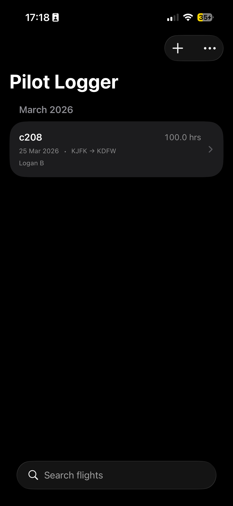

# Pilot Logger

<p align="center">
  
  &nbsp;&nbsp;&nbsp;
  
</p>

An iOS flight logging app built with SwiftUI, SwiftData, and modern Swift concurrency. Track flight history, hours, and airport routes with a clean, accessible interface.

## Features

- **Full CRUD** — Add, edit, delete flight logs with swipe-to-delete
- **Rich Data Model** — Date, aircraft type, PIC, flight time, departure/arrival airports, night hours, instrument hours, landings, remarks
- **SwiftData Persistence** — Local persistence with automatic schema management
- **Search & Filter** — Search across aircraft type, pilot, airports, and remarks
- **Sort Options** — Sort by date, flight time, or aircraft type
- **Statistics Dashboard** — Total hours, night/instrument breakdown, hours by aircraft type
- **Airport Autocomplete** — Offline-first airport lookup with ICAO/IATA codes via bundled dataset
- **WidgetKit Extension** — Small widget (total hours + last flight) and medium widget (recent flights list)
- **Accessibility** — VoiceOver labels/hints, Dynamic Type support
- **Dark Mode** — Automatic light/dark mode

## Architecture

MVVM with protocol-based dependency injection and actor-isolated services.

```
PilotLogger/
├── PilotLoggerApp.swift        → @main app entry point
├── ContentView.swift           → Root view, wires up services & view models
├── Models/                     → SwiftData @Model (FlightLog, Airport)
├── ViewModels/                 → @Observable view models (list, form, airport search)
├── Views/                      → SwiftUI views (list, detail, form, statistics)
├── Services/                   → Actor-based services (FlightLog CRUD, networking, airport search)
│   └── Protocols/              → Service protocol abstractions for DI & testing
├── Resources/                  → Bundled data (airports.json)
PilotLoggerWidget/              → WidgetKit extension (small + medium)
PilotLoggerTests/               → Unit tests (Swift Testing framework, mock services)
PilotLoggerUITests/             → UI tests for key user flows
```

## Technical Highlights

| Area | Detail |
|------|--------|
| Architecture | MVVM + protocol-based DI |
| Persistence | SwiftData (`@Model`, `ModelContainer`) |
| Concurrency | `async/await`, `@MainActor`, `@ModelActor`, `Sendable` |
| State | `@Observable`, `@Bindable`, `@State` (Observation framework) |
| Networking | Generic `NetworkService` protocol + actor implementation |
| Testing | Swift Testing (`@Test`, `#expect`), 43 unit tests + 4 UI tests, mock service layer |
| UI | SwiftUI with `NavigationStack`, `ContentUnavailableView`, `.searchable` |
| Widget | WidgetKit with `StaticConfiguration`, `TimelineProvider`, shared SwiftData model |
| CI/CD | GitHub Actions — build, test, SwiftLint |

## Requirements

- iOS 17.5+
- Xcode 15.4+
- Swift 5.10+

